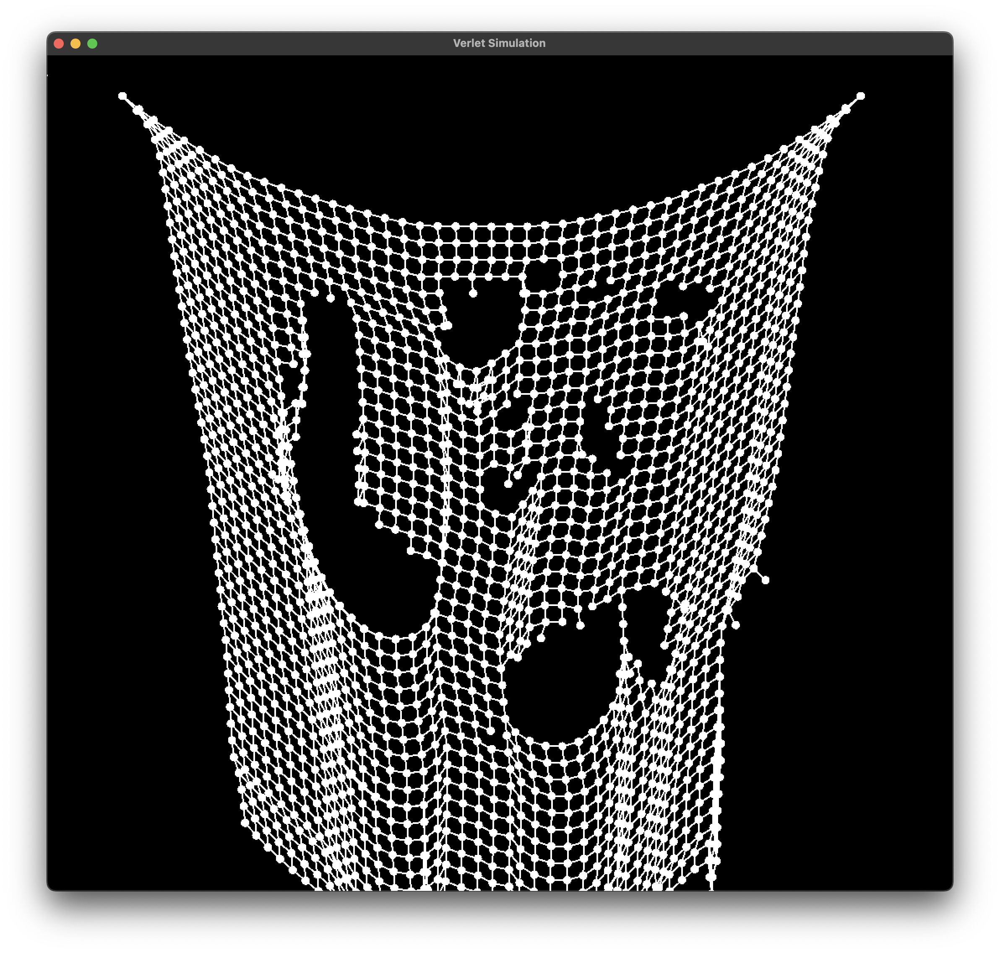

# Verlet Simulation

Cloth simulation with [Verlet integration](https://en.wikipedia.org/wiki/Verlet_integration),
built in C++ and SFML.



## Build and Run

```bash
cmake -S . -B build -DCMAKE_BUILD_TYPE=Release
cmake --build build
```

```bash
cd build
./Verlet
```

## Commands

- Left-Click to cut
- Press 'R' to reset
